


 


 



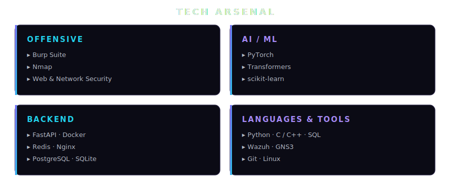

<h3 align="center">🚀 FEATURED PROJECTS</h3>

<a href="https://github.com/Harshi-coder17">
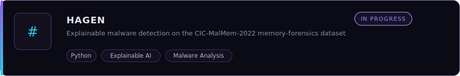
</a>
 
<a href="https://github.com/Harshi-coder17/CruxHunt-Writeups">
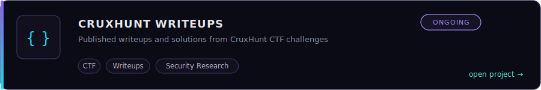
</a>
 
<a href="https://github.com/Harshi-coder17/chain-of-custody">
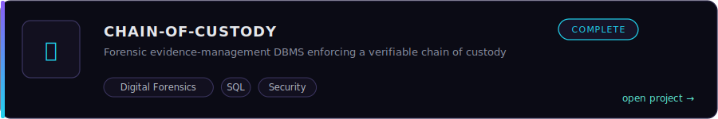
</a>
 
<a href="https://github.com/Harshi-coder17/aura-project">
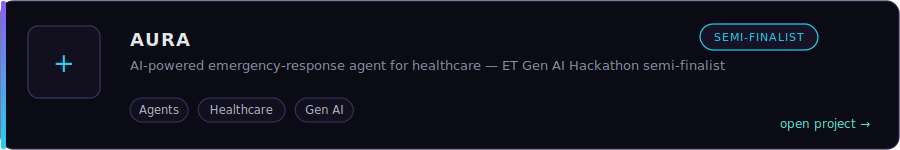
</a>
 
<a href="https://github.com/Harshi-coder17/q-shield-pnb">
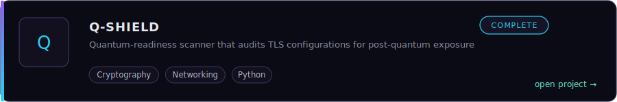
</a>
 
<a href="https://github.com/Harshi-coder17">
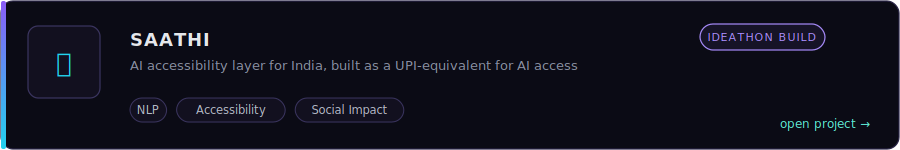
</a>

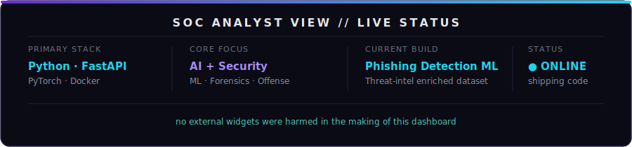

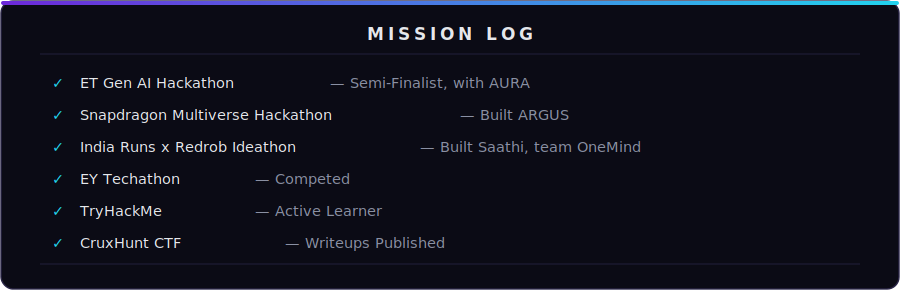


### 🤝 Connect 

 

